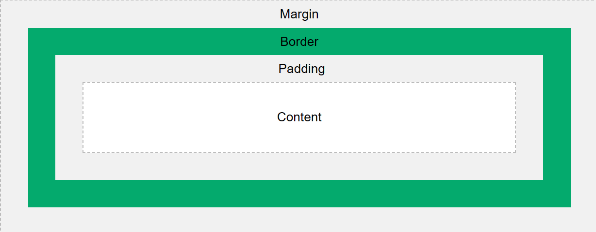

## CSS

CSS (Casading Style Sheets) dùng để mô tả cách mà HTML hiển thị bao gồm thiết kế, layout và với các thiết bị và màn hình có kích thước khác nhau.

## How to add CSS

Có 3 cách để thêm CSS

Inline: thêm thẳng vào thẻ bằng thuộc tính style

```
<h1 style="color:blue;text-align:center;">This is a heading</h1>
```

Internal: được viết trong thẻ style nằm trong head section

```
<style>
    body {
        background-color: red;
    }
</style>
```

External: viết ở một file khác là dùng thẻ link nằm trong head section

```
<link ref="stylesheet" href="mystyle    .css">
```

### Phân biệt inline, inline-block và block

- Inline: những thẻ inline sẽ nằm cùng một hàng và không thể chỉnh width và height
- Inline-block: những thẻ inline-block sẽ nằm cùng một hàng nhưng có thể chỉnh width và height
- Block: những thẻ block sẽ nằm trên 1 hàng

### Grid và Flexbox

Sự khác nhau cơ bản là flexbox được thiết kế cho layout một chiều nhưng grid được thiết kế cho layout 2 chiều. Ngoài ra flexbox lấy content làm nền tảng nhưng còn đối với grid là layout. Điểm mấu chốt là đối với grid, ta phải định nghĩa chiều rộng của cột sau đó mới đặt content vào.

### Position

Bao gồm 5 thuộc tính: static, relative, fixed, absolute và sticky

Một phần tử có position: absolute sẽ positioned phần tử relative cha gần nhất. Position: fixed thì phần tử relative là viewport, nghĩa là nó vẫn sẽ nằm ở cùng một vị trí nếu trang web được scroll. Position: sticky vẫn được giữ khi scroll. Khác nhau giữa fixed và sticky?

### CSS Units

Gồm 2 loại là Absolute Lengths (cm, mm, in, pt, pc) nhưng hay thường sử dụng nhất là px. Relative Lengths bao gồm em (phụ thuộc vào font-size thẻ cha gần nhất), rem (phụ thuộc vào thẻ html 1rem = 16px)

### Box-sizing: border-box

Khi ta set border, padding cho phần tử thì kích thước ban đầu tăng lên. Dùng Box-sizing: border-box sẽ tính toán lại phần content sao cho content với các phần tăng thêm bằng kích thước ban đầu đặt ra.

### Box Model



### Responsive

Responsive mang tới trải nghiệm tốt nhất cho mọi người dùng từ desktops, tablets và phones. Các break-point cơ bản:

1. Mobile - 320px
2. Tablet - 768px
3. Desktop - 1024px

```
@media only screen and (max-width: 600px) {
  div {
    background-color: red;
  }
}

```

### CSS Selector

https://www.w3schools.com/cssref/css_selectors.php

### CSS Pseudo-classes

Xác định trạng thái đặc biệt của một phần tử bao gồm hover, focus, visited, ...

### SCSS

SCSS là stylesheet language compiled thành CSS. SCSS cho phép sử dụng variables, nested ruled, mixixs, functions và hơn thế nữa. SCSS giúp giữ CSS well-organized và tái sử dụng.

#### Varibles

```
$font-stack: Helvetica, sans-serif;
$primary-color: #333;

body {
  font: 100% $font-stack;
  color: $primary-color;
}
```

#### Nesting

HTML có hệ thống cấp bậc khi các phần tử có thể lồng nhau và CSS không làm được điều đó nhưng SCSS làm được.

```
nav {
  ul {
    margin: 0;
    padding: 0;
    list-style: none;
  }

  li { display: inline-block; }

  a {
    display: block;
    padding: 6px 12px;
    text-decoration: none;
  }
}
```

#### Mixins

```
@mixin theme($theme: DarkGray) {
  background: $theme;
  box-shadow: 0 0 1px rgba($theme, .25);
  color: #fff;
}

.info {
  @include theme;
}
.alert {
  @include theme($theme: DarkRed);
}
.success {
  @include theme($theme: DarkGreen);
}

```
