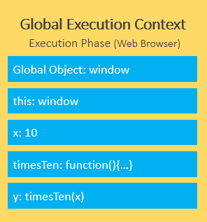

## Giới thiệu

Javascript là scripting language cho Web.

## Var, let và const

### Var

Trước ES6, khai báo var được sử dụng nhưng tính năng của var là có thể re-declared và updated và đây cũng tồn tại vấn đề của nó.

```
var greeter = "hey hi";
var times = 4;

if (times > 3) {
    var greeter = "say Hello instead";
}

console.log(greeter) // "say Hello instead"
```

Nhìn vào đoạn code trên nếu như ta khai báo greeter như một biến global và trong hàm lại vô tình re-declared biến thì có thể dẫn đến biến không mong muốn.

### Let

Let được tạo ra để giải quyết vấn đề này. Let is block scoped, một block là đoạn code trong dấu {}, điều đó nghĩa là khi vào hàm hay thậm chí if thì các khai báo sẽ khác biệt với nhau.

```
let greeting = "say Hi";
if (true) {
    let greeting = "say Hello instead";
    console.log(greeting); // "say Hello instead"
}
console.log(greeting); // "say Hi"
```

### Const

Const có scope tương tự let nhưng không thể updated. Tuy nhiên đối với object thì properties của nó có thể updated.

```
const greeting = {
    message: "say Hi",
    times: 4
}
```

```
greeting = {
    words: "Hello",
    number: "five"
} // error:  Assignment to constant variable.
```

```
greeting.message = "say Hello instead";
```

## Callbacks

Callback chỉ là một hàm mà được truyền vào trong một hàm khác, với mong muốn rằng nó có thể được gọi để thực thi một lúc nào đó. Nhưng khi có quá nhiều callbacks chồng vào nhau sẽ dẫn đến callback hell, làm khó đọc và debug.


## Promise

Promise là nền tảng của xử lý bất đồng bộ trong Javascript. Promise là một object được trả về bởi một hàm bất đồng bộ, đại diện cho trạng thái của hiện tại. Chúng ta xét đoạn code sau:

```
function myFunction() {
  new Promise(() => {
    console.log(1);
  });
  console.log(2);
}
```

Ta có thể đoán được kết quả sẽ là 1 và 2 vì chưa có xử lý bất đồng bộ tại đây. Ta hãy nhìn lại đoạn code được thay đổi một chút

```
function myFunction() {
  new Promise((myResolve) => {
    myResolve(1);
  }).then(value => console.log(value));
  console.log(2);
}
```

Bạn có thể đoán được kết quả lúc này? Đáp án là 2 và 1, tại sao lại như vậy?

## Event loop

Javascript có một runtime model dựa trên event loop, giúp thực thi code, collect và process events cũng như xử lý sub-tasks.


Điều cần biết là Javascript sử dụng single-thread run time. Để giúp xử lý bất đồng bộ đó là nhờ vào Web APIs, ví dụ như setTimeout() khi được gọi sẽ gọi API Timing để đếm và sau khi hoàn thành sẽ được đưa vào Callback queue để xử lý. Single-thread nên stack chỉ có 1 function được xử lý mỗi lần. Và điều này có thể giải thích phần nào cho câu hỏi về Promise. Dù myResolve được gọi ngay lập tức nhưng nó lại được đưa vào Callback queue và chỉ khi stack thực hiện tất cả các hàm và stack rỗng queue mới được đưa vào để xử lý.

```
function myFunction() {
  new Promise((myResolve) => {
    myResolve(1);
  }).then(value => console.log(value));
  console.log(2);
  console.log(3);
  console.log(4);
  console.log(5);
}
```

Ta hãy nhìn lại ví dụ trên. Và chắc chắn rồi ở đoạn code này đáp án là 2, 3, 4, 5, 1

Một trong những điểm lợi của Promise là tránh callback hell bằng cách dùng then chain


Một Promise có thể là một trong 3 trạng thái sau: pending, fulfilled và rejected và ta có thể dùng .then, .catch, .finally để làm callback

Ta xét một ví dụ sau:

```
console.log("Start")
setTimeout(() => {
  console.log("Timeout!")
}, 0)
Promise.resolve("Promise!")
  .then(res => console.log(res))
console.log("End!")
```

Thật sự thì Event Loop có 2 dạng queues: (macro) task queue và (micro) task queue. Trong đó (macro) task gồm setTimeout, setInterval, setImmediate. Microtask gồm Promise callback, ... Trong đó microtask sẽ được thực hiện trước macrotask, do đó kết quả của đoạn code trên là

```
Start!
End!
Promise!
Timeout!
```

## Async/Await

Khi await được gọi, nó sẽ đợi cho tới khi Promise kết thúc và trả về kết quả. Thay vì phải .then để gọi như ở Promise thì ta có thể sử dụng luôn await còn về try catch thì có thể try catch thẳng ở await thay vì .then rồi .catch

## Async/Await có thể thay thế được Promise

- Không hoàn toàn vì Async/Await vẫn sử dụng Promise ngầm. Ngoài ra có một số thao tác sử dụng Promise sẽ đem lại hiệu quả tốt hơn

```
async  function  getABC () {
  let A = await getValueA(); // getValueA takes 2 second to finish
  let B = await getValueB(); // getValueB takes 4 second to finish
  let C = await getValueC(); // getValueC takes 3 second to finish

  return A * B * C;
}
```

Nhìn vào ví dụ trên await sẽ dừng hàm async để chờ cho hành động được thực hiện xong mới chuyển sang hành động tiếp theo nên tổng thời gian để hoàn thành là 9s.

```
async  function  getABC () {
  // Promise.all() allows us to send all requests at the same time.
  let results = await Promise.all([ getValueA, getValueB, getValueC ]);

  return results.reduce((total,value) => total * value);
}
```

Tuy nhiên cách tối ưu hơn là ta cho 3 Promise chạy cùng lúc thì khi đó chỉ cần chờ cho hành động lâu nhất hoàn thành ở đây là 4s để thực hiện xong hàm. Tất nhiên đa số các trường hợp chúng ta sử dụng Async/Await là cho việc fetch API và chuyển thành json và nó phải thực hiện liên tục nhau thì sẽ không sử dụng Promise.all được ở trường hợp đó.

Thêm nữa là khi đụng vào từ khóa await hàm async sẽ được đưa vào microtask để thực hiện tiếp, điều này có nghĩa là các hành động khác sẽ tiếp tục được chạy chỉ có hành động trong hàm async bị dừng lại để đảm bảo yếu tố bất đồng bộ trong JS.

## this là gì?

Có một điều chúng ta biết rằng this refers to an object. Tuy nhiên this không chỉ đơn giản như vậy. Nếu chúng ta gọi this ở browser nó sẽ là Window object

```
console.log(this);
```

Nhưng nếu chúng ta gọi this ở bên trong một object thì đó là object đó và chúng ta có thể truy cập vào properties và methods của chúng

```
const myObj = {
  myThis : function() {
    return this;
  }
}
```

Nếu gọi this trong một function thì đó sẽ là object Window

### Arrow functions

Điều đặt biệt là arrow function không hoạt động giống với function vì nó không tạo ra execution context mà kế thừa từ hàm ngoài arrow function được định nghĩa. Vậy trước hết chúng ta cần tìm hiểu vậy execution context là gì?

### Execution Context

Execution Context là cách mà Javascript được thực thi bao gồm creation phase và execution phase. Hãy xét ví dụ sau:

```
let x = 10;

function timesTen(a){
    return a * 10;
}

let y = timesTen(x);

console.log(y); // 100
```

Và đây là cách chúng được thực thi ở creation phase


Đầu tiên Global Object sẽ được khởi tạo, rồi sẽ được this object bind vào. Sau đó heap memory sẽ được set up cho biến và hàm references. Cuối cùng là lưu các khai báo hàm và các biến thành undefined.




Điều quan trọng ở đây là với mỗi function call, Javascript engine tạo ra một function execution context. Cũng tương tự global execution context nhưng thay vì tạo global object, arguments object sẽ được tạo liên quan đến tất cả biến của hàm.


Trở về với arrow function, việc không tạo ra execution context nhưng nhận this từ hàm ngoài nó cũng cho this là Window. Và điều cần lưu ý là ta không thể lấy ra this nếu thực hiện arrow function trong object.

Và cuối cùng this trong Event Listener sẽ liên quan đến DOM element được kích hoạt.

## this methods

Có 3 methods là call, apply và bind. Với call và apply, nói theo một cách đơn giản, chúng ta có thể object nào mà keyword this refer đến, xác định tham số "this" cho một function

### Bind

```
const myObj = {
  name: "Khoi",
  age: 20
}

function display() {
  console.log(this.name + " " + this.age);
}

let showData = display.bind(myObj)
showData()
showData()
```

### Call

```
function display(school, hometown) {
  console.log(this.name + " " + this.age + " " + school + " " + hometown);
}

display.call(myObj, "HCMUS", "Long An")
```

### Apply

```
function display(school, hometown) {
  console.log(this.name + " " + this.age + " " + school + " " + hometown);
}

display.apply(myObj, ["HCMUS", "Long An"])
```

## Map, filter and reduce

### Map (thao tác với đối tượng, mảng để thay đổi các giá trị)

```
const myArray = [1, 2, 3, 4]
const myEvenArray= myArray.map(value => value * 2)
```

### Filter (Filter mảng nếu return true thì giữ lại phần tử, false thì loại)

```
const myEvenArray= myArray.filter(value => { return value % 2 === 0; })
```

### Reduce (Tính lũy các giá trị trả về)

## IIFE (hàm gọi ngay lập tức)
